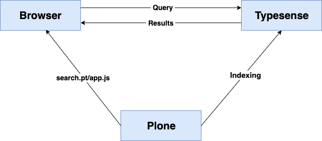
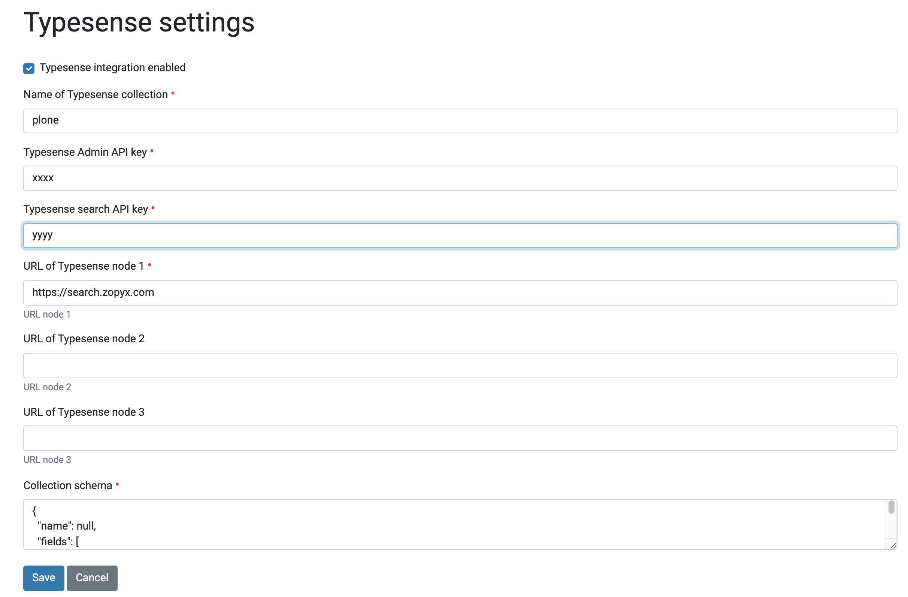
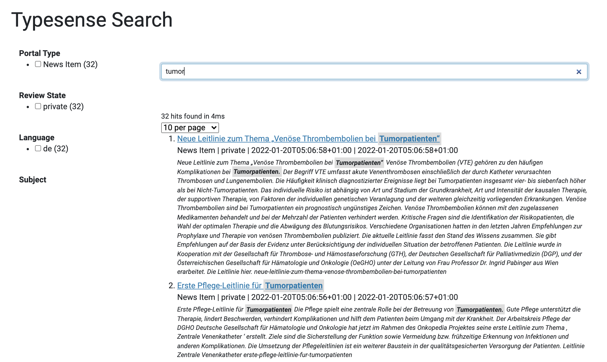

# zopyx.typesense

## What is zopyx.typesense

`zopyx.typesense` in an add-on for Plone 6 that provides an integration with
the search engine [Typesense](https://typesense.org/). The functionality is
similar with `collective.solr`.


The reasons for using Typesense are

- very easy to install (single binary or via Docker)
- multi-field text indexes
- auto-generated (but highly customizable) search UI
- optional facted search for refining fulltext queries
- minimal invasive into Plone (does not replace the ZCatalog)
- very fast search
- extensible and customizable
- scalable (through a Typesense cluster)
- federated search over multiple collections (aka Plone sites)
- open-source
- on-premise or Typesense cloud (commercial offering)

Click [here](https://user-images.githubusercontent.com/594239/150671828-f6a4c993-6afa-440b-af76-66de5ff94fe5.mp4) for an intro video.

### zopyx.typesense is not

- a replacement of the ZCatalog/portal_catalog (document changes are pushed to
  Typesense as an independent entity completely decoupled from Plone's
  portal_catalog)
- a drop-in replacement of the Plone search. zopyx.typesense comes with its own
  configurable auto-generated search UI

## Requirements

- Plone 6 (tested)
- Plone 5.2 (untested, supposed to work for Dexterity-only sites, under Python 3)

## Architecture



## Installation

Add `zopyx.typesense` to your buildout, re-run buildout and install it within Plone.

For Typesense installation, please check the installation docs of Typesense
(either for installation through Docker or through the standalone binary).

There is no public release at this time. You need to install `zopyx.typesense`
using `mr.developer` as source checkout from Github.
  
## Configuration

The `Typesense settings` within the Plone controlpanel:



- `Name of Typesense collection` - must be a unique name for the document pool
  of your Plone site
- `API Key` - the administrative API key (as configured in Typesense) 
- `Search API Key` - the search API key (as configured in Typesense) 
- `URL of Typesense node X` - the URL(s) of the Typesense node or Typesense
  cluster
- `Collection schema` - the schema of the Typesense collecton (see Typesense
  docs)

The `Typesense administration` within the Plone controlpanel:

 on the same machine using Docker:

```
docker run -p 8108:8108 -v /tmp/data:/data typesense/typesense:0.22.1 --data-dir /data --api-key=some_api_key --search-only-api-key=some_search_api_key --enable-cors
```

This command will store the Typesense data files under `/tmp/data` and open a
connection on port `8108`.  You need to specify two api keys: one for admin
access and one for search api.

After installing `zopyx.typesense` in Plone, you would specify both API keys in
the Typesense control panel within Plone along with `http://localhost:8108` as
URL for Typesense node 1.


## Search UI



The search UI is auto-generated from a minimal HTML template which defines the
basic layout together with the widgets to be used [see
here](src/zopyx/typesense/browser/search.pt).

The integration of the template with the Typesense UI generator is impleted
through some lines of Javascript code in
[src/zopyx/typesense/browser/static/app.js](src/zopyx/typesense/browser/static/app.js).


## Views

- `@@typesense-search` renders the main (auto-generated) search form. This view can be applied on
  any folder level. This view applied on a folder implies a filter by subpath (only indexed content
  with the given folder will be searched).

- `@@typesense-settings`  renders the Plone control panel of Typesense

- `@@typesense-settings`  renders the Plone control panel of Typesense

- `@@typesense-admin` renders the administration control panel for Typesense

- `@@typesense-indexed-content` applied on any arbitrary content object will
  display all data indexed for the given content object

## Indexing integration

`zopyx.typesense` integrates into Plone using the lifecycle event for content
being added, updated, deleted (plus workflow changes). By default,
`zopyx.typesense` indexes all metadata of all content objects (basically Dublin
Core) plus the textual content of a content objects (title, description and the
content of all `RichText` fields).  Similar to Plone's `SearchableText` index,
all textual content is being indexed within Typesense in the `text` field.

It is possible to override the indexing behavior per-content-type using an
indexing adapter implementing `ITypesenseIndexDataProvider`. See [here for an
example](https://github.com/zopyx/zopyx.typesense/blob/master/tree/master/src/zopyx/typesense/adapters).

### Indexing binary content and office formats

The indexer for the `File` content-type has optional support for indexing
binary content or office formats using Apache [TIKA](https://tika.apache.org/).
The server URL of the (optional) Tika server must be configured through the
`Typesense` control panel. The most simple approach for running Tika is by
using Docker:

```
docker run -d -p 9998:9998 apache/tika
```

Configure Tika within the Typesense control panel as `http://localhost:9998`.
Ensure that the configuration regarding host, IP address and port numbers fit
your security requirements (usually, you don't want expose an internal service
on public IP addresses, but localhost only). 


## Bulk reindexing
The Typesense admin control panel contains a button `Reindex all` which will 

- create a new collection whose named is defined as <collection_name>-<current date>
- submit all Dexterity content objects for reindexing
- alias the new collection with the official name of the configured collection

## Transactions and eventual consistency

All indexing/unindexing operations happen asyncronously to Plone and outside
Plone's transaction system.  So, content changes might be available in
Typesense with a short delay. 

## Cavecats and known issues

- `zopyx.typesense` does not integrate (by-design) with Plone's security and
  access model.  The main purpose of `zopyx.typesense` is to act as a search
  engine for public sites.  So it is recommended at this time to index only
  public content.

## Resources

- [Typesense website](https://typesense.org)
- [Typesense API](https://typesense.org/docs/0.22.2/api)
- [InstantSearch.js](https://www.algolia.com/doc/api-reference/widgets/js)

## Author

Andreas Jung | info@zopyx.com | www.zopyx.com
